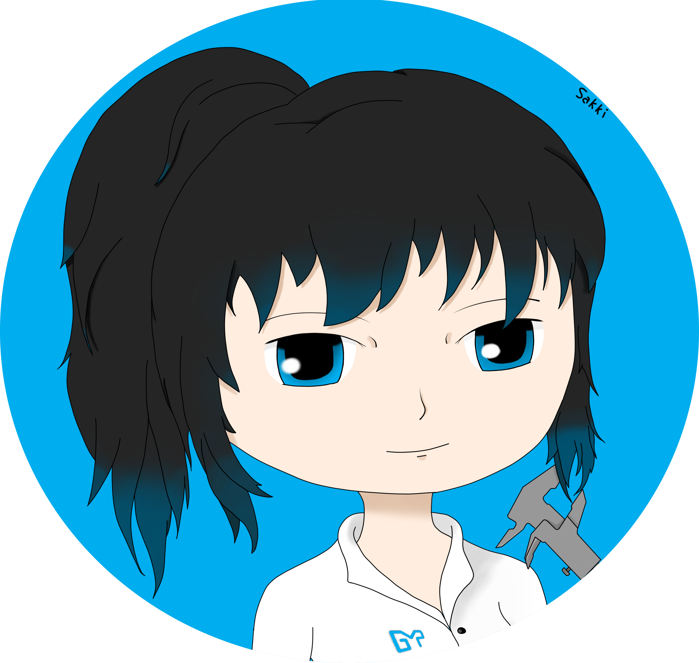

# Portfolio de Léa JEAN



Le site est accessible via ce [lien](https://sakki3.github.io/Portfolio/)

## 🔧 Développement

1. Cloner ce dépot
2. S'assurer d'avoir bien installer hugo
3. Réaliser les commandes suivantes

```bash
# setup project
$ npm run project-setup

# Start local dev server
$ npm run dev
```

<!-- licence -->
## 📄 License

Ce portfolio est issu du theme [Academia Hugo](https://github.com/gethugothemes/academia-hugo).

Copyright &copy; Designed by [Themefisher](https://themefisher.com) & Developed by
[Gethugothemes](https://gethugothemes.com)

**Code License:** Released under the [MIT](https://github.com/themefisher/academia-hugo/blob/master/LICENSE.md) license.
